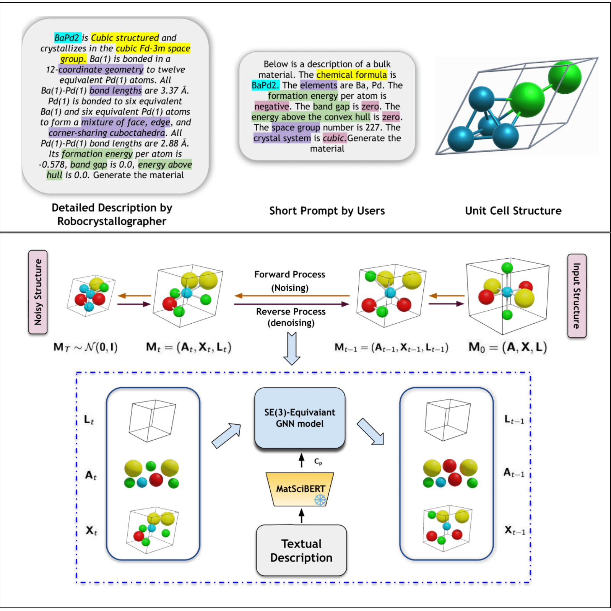

# TGDMat: Periodic Materials Generation using Text-Guided Joint Diffusion Model (ICLR 2025)

[](https://arxiv.org/pdf/2503.00522)
[](https://github.com/kdmsit/TGDMat/)


Code for the ICLR 2025 paper [*"Periodic Materials Generation using Text-Guided Joint Diffusion Model"*](https://arxiv.org/pdf/2503.00522), 
by [Kishalay Das](https://kdmsit.github.io/), 
Subhojyoti Khastagir, 
[Pawan Goyal](https://cse.iitkgp.ac.in/~pawang/), 
Seung-Cheol Lee, 
[Satadeep Bhattacharjee](linkedin.com/in/satadeep-bhattacharjee-545567114/),
and [Niloy Ganguly](https://niloy-ganguly.github.io/).


TGDMat introduces a novel approach to generating 3D periodic materials using a text-guided diffusion framework:
- TGDMat is the first model to connect natural language understanding with the generation of 3D periodic materials.
- Simultaneously generates atomic coordinates, element types, and lattice parameters, while preserving essential periodic symmetry.
- Leverages rich, descriptive prompts to guide the creation process, enabling generation aligned with specific material properties and user intent.
- Outperforms existing state-of-the-art methods in accuracy and generalizability, with reduced training and inference costs.



## Installation
The list of dependencies is provided in the `requirements.txt` file, generated using `pipreqs`. Yiu can install through following commands:
```bash
pip install -r requirements.txt
```
However, there may be some ad-hoc dependencies that were not captured. 
If you encounter any missing packages, feel free to install them manually using `pip install`.

## Textual Dataset
Text-guided reverse diffusion remains unexplored in material design, partly due to the lack of textual data in benchmark databases. To address this, we propose two methods for generating material descriptions: 
- (1) Using Robocrystallographer for detailed structural texts, and 
- (2) Creating shorter, user-friendly prompts with basic material info like chemical formula, elements, crystal system, and space group.

We kept the textual data for Perov-5, Carbon-24 and MP-20 databases in `data_text/` directory.
## Usage

### Crystal Structure Prediction(CSP) Task
Move to 'csp_task' directory

#### Train TGDMat Model

```bash
    python -W ignore train.py --dataset <Dataset> --batch_size 512 --epochs 500 --prompt_type <long/short>
```

 - Where <Dataset> is perov_5/carbon_24/mp_20
 - Model saved at  out/<Dataset>/<expt_date>/<expt_time>/   

##### Evaluate TGDMat Model for CSP Task with #sample(k) = 1
```bash
python -W ignore evaluate.py --model_path 'gen/' --chkpt_path  <saved_model_path> --tasks csp --num_evals 1 --dataset <Dataset> --batch_size 1024 --timesteps 1000 --prompt_type <long/short>  
python compute_metrics.py --root_path gen/perov_5/ --tasks recon
```

##### Evaluate TGDMat Model for CSP Task with #sample(k) = 20
```bash
python -W ignore evaluate.py --model_path 'gen/' --chkpt_path  <saved_model_path> --tasks csp --num_evals 20 --dataset <Dataset> --batch_size 1024 --timesteps 1000 --prompt_type <long/short>  
python compute_metrics.py --root_path gen/perov_5/ --tasks recon --multi_eval
```

### Random Material Generation(Gen) Task
Move to 'generate_task' directory

##### Train TGDMat Model
```bash
python -W ignore train.py --dataset <Dataset> --batch_size 512 --epochs 500 --prompt_type <long/short>
```
 - Where <Dataset> is perov_5/carbon_24/mp_20
 - Model saved at  out/<Dataset>/<expt_date>/<expt_time>/

##### Evaluate TGDMat Model for Material Generation Task
```bash
python -W ignore evaluate.py --model_path 'gen/' --chkpt_path  <saved_model_path> --tasks gen --dataset <Dataset> --batch_size 1024 --prompt_type <long/short>
python -W ignore compute_metrics.py --root_path gen/<Dataset>/ --tasks gen --gt_file <Test dtaset csv file path>
```


For any further query, feel free to contact [Kishalay Das](kishalaydas@kgpian.iitkgp.ac.in)

## How to cite

If you are using TGDMat or our Textuak Dataset, please cite our work as follow :

```
@article{das2025periodic,
  title={Periodic Materials Generation using Text-Guided Joint Diffusion Model},
  author={Das, Kishalay and Khastagir, Subhojyoti and Goyal, Pawan and Lee, Seung-Cheol and Bhattacharjee, Satadeep and Ganguly, Niloy},
  journal={arXiv preprint arXiv:2503.00522},
  year={2025}
}
```


# OrbDiff for TGDMat
Implementation of **TGDMat** adapted for [Periodic Materials Generation using Text-Guided Joint Diffusion Model (ICLR 2025)](https://arxiv.org/pdf/2503.00522).
---
### 🚀 Dependencies and Setup
Please refer to the original [TGDMat repository](https://github.com/kdmsit/TGDMat/).

### 🔧 Training
To train the model, run:
```
bash run.sh <dataset> <prompt_type> <number-of-transition> <wn_noise>
```
-  `dataset`: `perov_5` or `mp_20`
-  `number-of-transition`: the number of transitions
-  `prompt_type`: `long` or `short`
-  `wn_noise`: `True` for Wrapped Normal (WN), `False` for Uniform (U)
    - For baseline runs, set `number-of-transition`=0 and `wn_noise` is ignored.
The model, logs, and outputs will be saved in `./csp_task/out/${dataset}_${prompt_type}_trans${num_trans}_[U or WN]_ddmmyyyyHHMMSS` for OrbDiff and `./csp_task/out/${dataset}_baseline_ddmmyyyyHHMMSS` for baseline.

#### Example runs
- OrbDiff:
```
# Wrapped Normal noise
bash run.sh perov_5 short 1000 True
# Uniform noise
bash run.sh perov_5 short 1000 False
```
- Baseline:
```
bash run.sh perov_5 short 0
``` 
Our pre-trained OrbDiff checkpoints are provided [here]().

### 📊 Evaluation
To evaluate a trained model, run:
```
bash eval.sh <root_path> <dataset> <label>
```
- `root_path`: absolute path to trained model directory
- `label`: string to differentiate different evaluations
The output will be saved in `<root_path>/eval_recon_<label>.pt` and metríc will be saved in `<root_path>/eval_recon_<label>.txt`